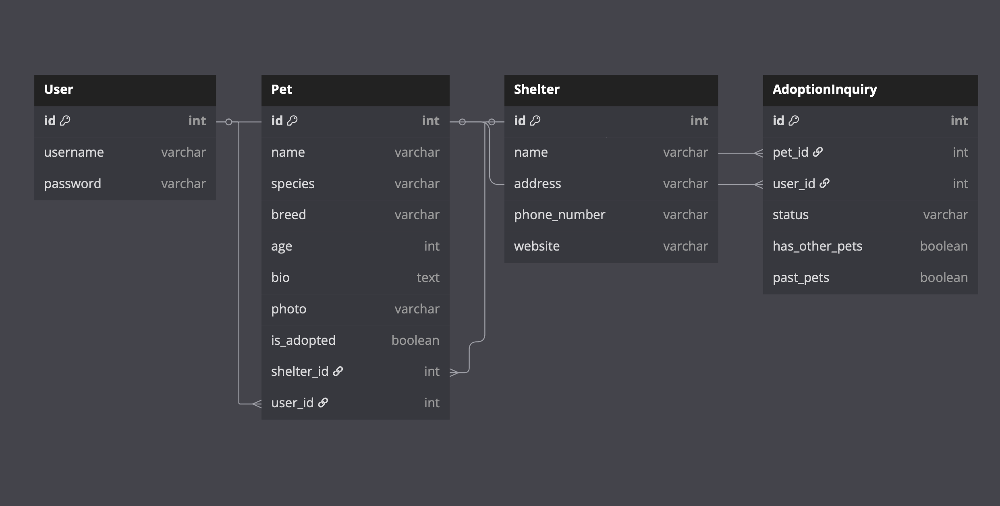

# **Waggle – Pet Adoption Platform**



---

## **App Description**

**Waggle** is a full-stack web application that connects potential pet adopters with local shelter pets. The platform makes it easy to discover, learn about, and apply to adopt pets in need of loving homes. Users can browse pet profiles, submit adoption inquiries, and manage their adoption applications through a personalized dashboard.

This app was built using the **Django** framework with a focus on:

- **User authentication and authorization**
- **CRUD functionality for pets and adoption inquiries**
- **Responsive design for all devices**
- **Clean, intuitive UI/UX design**
- **Database relationships between Users, Pets, and Adoption Inquiries**

---

## **Routes & Button Actions**

| **Method** | **Route**                | **Description**                    | **Auth Required** |
|------------|--------------------------|------------------------------------|------------------|
| **POST**   | `/sign-in`              | Handle user login                  | No               |
| **POST**   | `/sign-up`              | Handle user registration           | No               |
| **POST**   | `/signout`              | Handle user logout                 | Yes              |
| **GET**    | `/pets`                 | View all available pets            | No               |
| **POST**   | `/pets`                 | Create new pet listing             | Yes (Shelter)    |
| **GET**    | `/pets/:id`             | View specific pet details          | No               |
| **PUT**    | `/pets/:id`             | Update pet information             | Yes (Shelter)    |
| **DELETE** | `/pets/:id`             | Remove pet listing                 | Yes (Shelter)    |
| **GET**    | `/adoption-inquiry`     | View all pending inquiries         | Yes              |
| **POST**   | `/adoption-inquiry`     | Submit new adoption inquiry        | Yes              |
| **PUT**    | `/adoption-inquiry/:id` | Update adoption inquiry            | Yes              |
| **DELETE** | `/adoption-inquiry/:id` | Cancel adoption inquiry            | Yes              |

---

## **Wireframes & ERD Planning**

Wireframes and ERD diagrams were created to visualize key user flows and data models.

---

### **Full Wireframe Overview**


---

## **Component Hierarchy**


---

## **Technologies Used**

- **Django** – Backend framework
- **Python** – Programming language
- **SQLite** – Database
- **HTML/CSS** – Frontend structure and styling
- **JavaScript** – Frontend interactivity
- **Bootstrap** – UI framework
- **Railway** – Deployment platform

---

## **MVP Features**

- **User registration and authentication**
- **Browse available pets with detailed profiles**
- **Filter pets by species, breed, age, and location**
- **Submit and manage adoption inquiries**
- **Edit pet information (shelter users)**
- **Responsive layout for mobile and desktop**
- **Clear success/error feedback messages**

---

## **MVP User Stories**

- **Register and log in** to access personalized features
- **Browse all adoptable pets** without logging in
- **Filter pets** by various criteria to find the perfect match
- **Submit adoption inquiries** for pets of interest
- **Manage adoption inquiries** (edit or cancel)
- **Edit pet information** (shelter users only)
- **Receive clear feedback** for all actions

---

## **Stretch Goals**

- **Shelter View Dashboard**
  - Complete shelter management interface
  - Pet profile management
  - Adoption inquiry management

- **Appointment Scheduling**
  - Book meet-and-greet appointments
  - Calendar integration
  - Email notifications

- **Pet Health Portal**
  - Vaccination records
  - Medical history
  - Behavioral assessments

- **Analytics Dashboard**
  - Listing view metrics
  - Inquiry rates
  - Adoption turnaround times
  - Volunteer impact tracking

---

## **Getting Started**

1. Clone the repository
2. Install dependencies:
   ```bash
   pip install -r requirements.txt
   ```
3. Set up the database:
   ```bash
   python manage.py migrate
   ```
4. Run the development server:
   ```bash
   python manage.py runserver
   ```

---

## **Contributors**

- [Your Name] - Full Stack Developer
- [Team Member Names] - Additional Contributors

---

## **License**

This project is licensed under the MIT License - see the LICENSE file for details. 